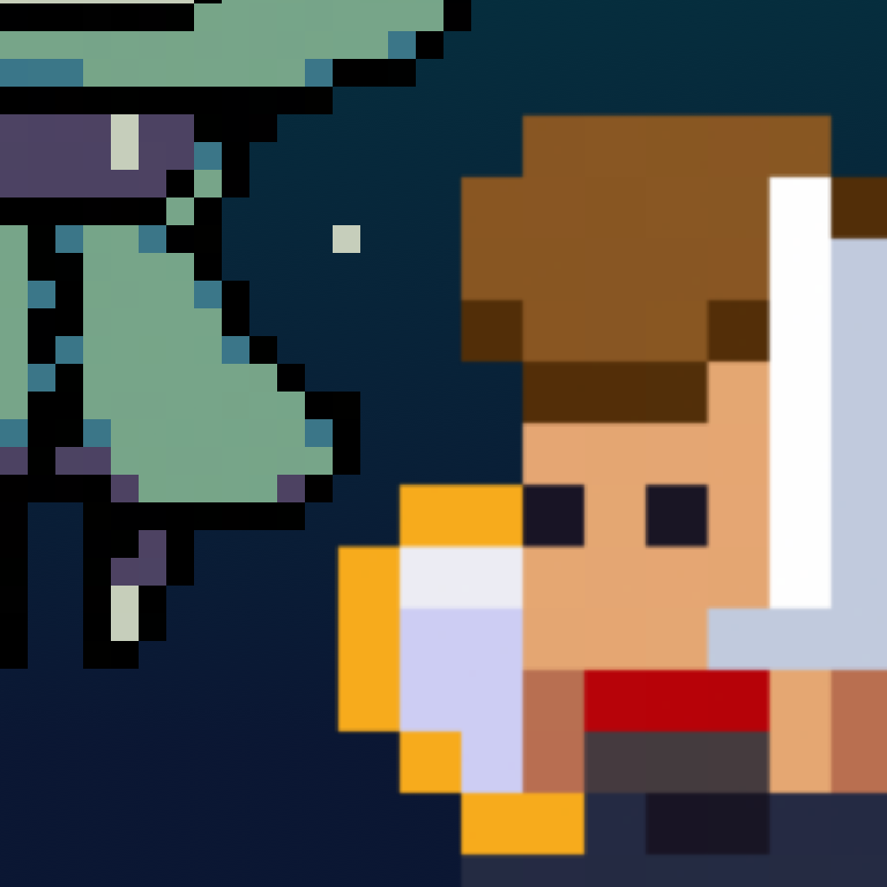
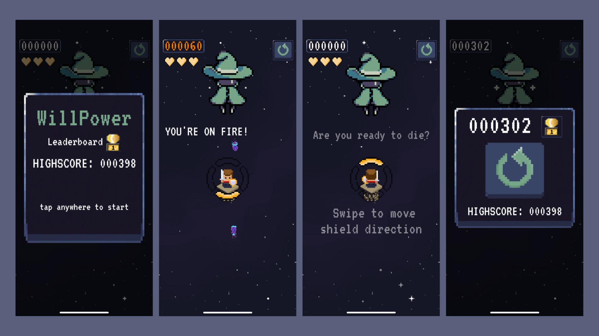

# WillpowerProject
An iOS Arcade Game made during a 3 days Game Jam with SpriteKit and GameplayKit
* Frameworks: SpriteKit, GameplayKit, GameKit, GoogleMobileAds

 
 
 
 
 

Since humankind has memory, the world was continuously threatened by strange and mysterious creatures. While there are people who accept their “fate” and live in constant terror, brave warriors refuse to give up.
One of them is Orteus, a young aspiring paladin that you command in order to defeat invading enemies. His defense skills, despite the juvenile age, surpass even the strongest shield master.
Help Orteus fight Magello, a powerful mage able to travel through different galaxies, swiping his shield in the right direction to block his attacks!

WillPower - Magello Battle is an Arcade game born during a 3-days Game Jam where you can put your reflexes to the test, we're looking forward to release a full game version!

## Gallery

